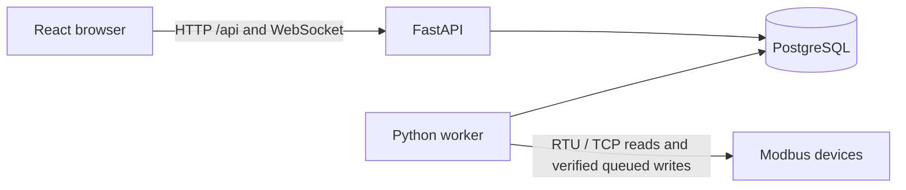
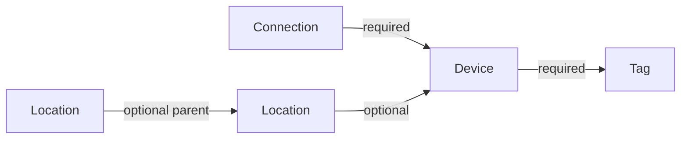
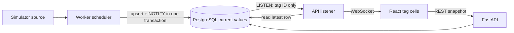
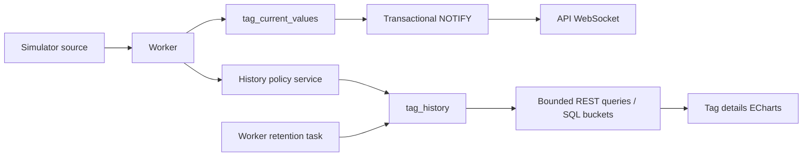

# Architecture

## Backup and configuration transfer

Phase 12 adds an ADMIN-only API and System page for encrypted PostgreSQL snapshots and
portable configuration transfer. Backup artifacts live on a private persistent volume;
secrets are excluded from the settings snapshot. Full database dumps are encrypted because
they contain authentication hashes and private runtime data. The API validates restore
archives but cannot replace a live database: an offline maintenance command stages and
checks a new database, then switches atomically while retaining the original for rollback.
Configuration imports validate the relational graph and commit once; imported Connections,
Automation and Alarms start disabled. Cloud cannot become a configuration authority through
import. Post-restore sync is fenced until distributed state is reviewed; normal polling,
Automation and outbox semantics are unchanged. See [recovery operations](backup-restore.md).

## Components

The monorepo contains one Python package (`server/app`) and a React/TypeScript client.
API and worker use the same settings, SQLAlchemy infrastructure, and ORM models,
but run in separate containers. Only the worker may access device networks or serial ports.
PostgreSQL stores all runtime configuration. Environment variables contain process
infrastructure settings only (database connectivity, logging, CORS, heartbeat interval).

The API provides health checks, configuration CRUD, current-value snapshots, and live WebSockets.
The separate worker acquires telemetry from the explicitly selected simulator or Modbus source and persists latest values.
Dashboards, Automation and Alarms use existing configuration and telemetry services. Phase 10 enforces local authentication and role permissions. All control actions use the persistent command pipeline, with physical writes disabled by default. Shell navigation is static; dashboard and widget instances are database records, never source-code configuration.

## Configuration flow (Phase 2)

The existing React shell now contains Locations, Connections, Devices, and Tags management pages.
Forms call typed HTTP clients, display server validation errors, and require confirmation before
deletion. Tag search and filters run on the API, with paginated lists. Selectors load their options
from the database; no device inventory, serial port list, or register map is embedded in the client.
Form defaults are editable and are persisted on save; defaults do not create runtime records.

Small route modules call shared validation/persistence helpers and SQLAlchemy async sessions.
Response schemas define the public contract. PATCH first locks its target row, merges explicitly
provided fields into the stored values, then runs full create-schema validation. Foreign keys and
constraints protect races after validation. No write silently clears dependent records.

Location hierarchy mutations take a PostgreSQL `SHARE ROW EXCLUSIVE` table lock before reading
ancestors, serializing these infrequent configuration changes across API processes. This prevents
concurrent reciprocal parenting from passing independent cycle checks. Direct SQL configuration
editing is unsupported: the self-parent constraint is database-enforced, but general ancestor cycle
checks belong to the API. A future alternate writer must implement the same invariant.

HTTP outcomes: create 201, reads/updates 200, delete 204, missing record 404, invalid configuration or
missing referenced parent 422, uniqueness conflicts or referenced deletions 409. Failed mutations
roll back. Configuration writes require an authenticated ADMIN; keep the local development deployment private.

## Live telemetry flow (Phase 3)

`TelemetrySource` is a worker-only boundary returning a typed `Reading`. `SimulatorSource` and `ModbusSource` share it without changing storage or browser contracts.
One monotonic scheduler manages due tags; no task/busy loop per tag. Missed periods are skipped rather
than replayed in a burst. Configuration is cached and refreshed every `WORKER_CONFIG_REFRESH_SECONDS`
(default 2). A tag is effective only when it, its device and its connection are all enabled. The worker
rechecks configuration versions under short shared row locks before persistence and discards readings
acquired against obsolete configuration. Errors are logged per tag and do not stop the loop.

Each upsert and `pg_notify` share a transaction. Notifications carry only a tag ID and arrive on commit.
Each API process owns a dedicated asyncpg LISTEN connection, reads current rows through SQLAlchemy,
and fans out schema-defined messages. This works across separate containers and multiple API processes.
The listener probes idle connections and reconnects with capped exponential backoff, asking clients to
resnapshot afterward. NOTIFY is neither a queue nor history: intermediate updates may be coalesced.

Client queues are bounded; overflow sends `resync_required`. Slow clients cannot block others. Browser
origins are checked against `CORS_ORIGINS`, independently of HTTP CORS. Idle sockets receive heartbeats.
The browser loads a snapshot, opens a single reference-counted socket while the Tags page is mounted,
then snapshots again after `ready` to close the initial connection gap. It resnapshots after reconnect
or resync. Per-tag revisions prevent older snapshots overwriting newer live events. Per-tag external
store subscriptions update only affected value/quality/time cells without refreshing configuration lists.

The API runs quality-only stale maintenance so stopping the worker still produces STALE transitions.
Only GOOD values older than `STALE_MULTIPLIER * poll_interval_ms` become STALE (default multiplier 3,
check interval `STALE_CHECK_SECONDS=1`). Conditional revision checks protect newer samples. The value
and last successful source timestamp remain unchanged. Explicit BAD/COMM_ERROR/DISABLED states retain
their meaning instead of being replaced by STALE. This is shared service logic, not API-generated data.

Run one telemetry worker in this phase, enforced by a PostgreSQL advisory lock. Per-connection
serialization protects physical buses; distributed worker sharding is deferred. See [live protocol](live-protocol.md) for message and recovery contracts.

References: [PostgreSQL NOTIFY commit semantics](https://www.postgresql.org/docs/16/sql-notify.html),
[LISTEN startup races](https://www.postgresql.org/docs/18/sql-listen.html),
[asyncpg listeners](https://magicstack.github.io/asyncpg/current/api/index.html).

## Historical flow (Phase 4)

Phase 4 history is implemented separately from latest state:

The shared current-value service invokes the history writer after its upsert and before NOTIFY.
Worker configuration supplies policy without a second full configuration query. Every-sample GOOD
writes append directly; fixed-interval/on-change/quality transitions read one indexed latest row,
so restart recovery and rollback cannot leave an in-memory policy cache inconsistent.
History runs inside a savepoint with PostgreSQL lock/statement timeouts (250ms/1s), and failures are
logged while allowing the current value and notification to commit. A database-wide outage can still
prevent the whole transaction. The API only records quality markers; it never generates readings.

Retention is a separate worker task with short committed batches. The Tag details page retains the
existing live store while historical charts use independent REST requests on range change/manual
refresh. No WebSocket event triggers a history refetch. See [history](history.md) for exact semantics.

## Future flow

1. Authorized users manage locations, connections, devices, tags, and visualization records through the API.
2. The worker reads configuration from PostgreSQL and schedules polling by connection/bus.
3. Worker readings update current values with timestamp and quality; history uses a separate retention/sampling policy.
4. The API already publishes current values through WebSocket and serves historical queries.
5. Authorized write requests create audited command records; the worker executes eligible commands and records results.

The Phase 6 manual command queue implements claiming and verification without adding a broker.
Phase 7 Automation shares this queue; Phase 10 adds authenticated manual attribution and role checks.
Do not claim exactly-once execution for device writes.

## Lifecycle and errors

Each process owns its async engine and disposes it on shutdown. Sessions are scoped to requests
or heartbeat operations, never shared concurrently. `/api/health` is process liveness;
`/api/health/db` executes a bounded `SELECT 1`, returning 503 on connectivity failure. Unexpected
errors return a sanitized 500 response and are logged with exception details. Logs are JSON on stderr.
Worker database failures are logged and retried on the next heartbeat. SIGINT/SIGTERM request a clean stop.

Compose waits for PostgreSQL, then the API runs `alembic upgrade head` before serving. Worker and
frontend wait for API readiness. This migration arrangement assumes a single API instance; use a
dedicated release migration step before future horizontal scaling. No schema creation occurs at import time.

Compose exposes ports on localhost only and persists PostgreSQL in a named volume. The frontend
container runs Vite for local development and proxies `/api` to the API container. A production
deployment will need static asset serving, TLS, restrictive origins, secrets management,
and an Nginx deployment configuration in a later task. Do not expose this foundation to public networks.

Implementation references: [SQLAlchemy async sessions](https://docs.sqlalchemy.org/en/20/orm/extensions/asyncio.html),
[Alembic async migrations](https://alembic.sqlalchemy.org/en/latest/cookbook.html#using-asyncio-with-alembic),
and [Compose dependency readiness](https://docs.docker.com/compose/how-tos/startup-order/).

## Read-only transports (Phase 5)

The worker manager owns one async PyModbus client/lock per configured connection. The shared scheduler
runs at most one read per connection with bounded independent connection concurrency. Configuration
refresh replaces changed transports and cancels obsolete reads; contiguous due tags share reads while per-tag decoding remains isolated.
A dedicated PostgreSQL advisory session lock prevents two workers from acquiring the same buses.
Ownership loss cancels collection and closes clients; database recovery retries ownership.

`connection_runtime` stores transport state and a narrow, expiring transport-test mailbox.
The API records a test request; only the worker opens the transport. This is not a general command
queue and cannot execute device writes. `worker_runtime` contains mode, heartbeat and worker-host
serial discovery. Device availability is derived from current enabled Tag qualities.

Current/history source labels preserve provenance; retained failed values retain their original source.
Switching between simulator and real readings records a history gap before successful new-source data.
No automatic simulation fallback exists. See [Modbus](modbus.md) and [deployment](modbus-deployment.md).

## Verified commands (Phase 6)

Frontend -> API validation -> PostgreSQL commands -> worker claim -> shared transport lock -> write ->
read-back -> current/history update + command result + transactional NOTIFY -> existing API WebSocket.
Only the command processor issues write functions. The API may enqueue/cancel but never opens a Modbus
client. All physical control, including Phase 7 Automation, uses this same persistent pipeline.

The worker commits status transitions, revalidates immutable target versions, and uses the existing
RTU mutex/client. Configuration share locks prevent retargeting during a bounded action. Current-state
persistence rejects older acquisition times. Startup fails interrupted commands rather than replaying
uncertain physical effects. PostgreSQL remains the sole shared infrastructure; no command broker added.
See [commands](commands.md) for retry boundaries, expiry, exact value encoding, simulator behavior and
why successful register read-back is not proof of mechanical actuation.

## Phase 7 Automation

The existing worker now hosts a separate AutomationEngine alongside polling, history maintenance
and command processing. PostgreSQL current values -> typed condition evaluation -> persistent
commands -> existing verified write processor. The engine has no transport dependency. Runtime
state and execution-to-command links survive restart. See [automation semantics](automation.md).

## Phase 8: Alarms and notifications

AlarmEngine is a separate worker task observing current values, with independent rules/runtime/events.
It does not enqueue commands or change Automation. Alarm transitions commit PostgreSQL NOTIFY with
the event; the existing API listener and frontend socket distribute invalidations. A durable Telegram
outbox is consumed by a separate bounded HTTP task, so delivery latency never blocks polling or control.
Non-secret chat destination is relational configuration; the bot token lives only in worker environment.
See [alarms](alarms.md) for quality, restart, lifecycle and delivery semantics.

## Phase 8.1 worker USB binding

SerialBinder is a worker task under the same exclusive lease. It periodically enumerates USB serial
metadata and resolves Auto Connections; it may run bounded, configured read-only probes. APIs only
manage identity and diagnostic mailboxes. The existing ConnectionManager uses the resolved port
for polling/tests/commands; per-physical-port locks also cover temporary probe clients. Other
connections continue independently. See [serial binding](serial-binding.md).

## Dynamic dashboards

Phase 9 adds configuration-only Dashboard APIs and a React Grid Layout editor. Relational widget Tag bindings feed the existing shared LiveStore; charts use history REST, alarm lists reuse Alarm APIs/events, and control widgets reuse verified Commands. No worker transport or Automation/Alarm logic is added. See [Dashboard Builder](dashboards.md).

## Phase 10: authentication boundary

HTTP API dependencies resolve opaque PostgreSQL-backed sessions and enforce role permissions before
business handlers. All configuration mutations default to ADMIN; manual command requests/cancellation
and alarm acknowledgements explicitly allow OPERATOR. Frontend role checks only adjust the UI.
WebSocket handshakes use the same cookie and revalidate sessions during the connection. A revoked
session closes the socket; clients clear shared live state and return to login. No per-widget sockets.

Worker telemetry, Automation, notifications and persistent command processing still use their existing
PostgreSQL workflows with no interactive session. Manual command requests carry the authenticated
user's ID and username snapshot; automation commands keep their existing source and no fabricated user.
Audit writes commit with API mutations. See [security](security.md) for the complete boundary and setup.

## Edge / Cloud

Phase 11 adds standalone/edge/cloud modes, a separate Edge sync process and application-level store-and-forward. Edge PostgreSQL transaction triggers produce durable outbox events; Cloud applies idempotent native relational mirrors and publishes existing browser notifications. Remote requests return through a durable inbox and the existing Command processor. No Cloud dependency is introduced into polling or Automation. See [deployment/protocol details](edge-cloud.md).

## Production Cloud boundary (11.1)

A dedicated application Compose stack serves compiled React through non-root nginx. An independent shared Caddy gateway routes same-origin frontend/API/WSS through the external web network and exclusively owns public ports. PostgreSQL stays on its internal database network; a one-shot preflight/Alembic service gates API startup. No hardware worker or local Automation engine exists in this stack. Cloud and Edge both gate physical writes using their own MODBUS_WRITES_ENABLED setting. See [operations and trust boundaries](production-cloud.md).

## Phase 11.2 synchronization lanes

Edge capture atomically replaces pending current/runtime snapshots in the existing outbox.
History and events remain append-only durable deliveries. The sync client uploads current
state before a bounded historical batch; Cloud mapping sequences reject stale packets.
ACKs reference exact event UUIDs so a concurrent replacement cannot be lost. Shared browser
WebSocket and local worker architecture are unchanged. See [details](realtime-sync.md).

## Manual updater (Phase 13)

An ADMIN requests release preparation through the existing session/CSRF-protected API.
The API validates GitHub release assets and creates a Phase 12 encrypted backup. A separate
opt-in host runner deploys only the supported production Cloud Compose topology. It uses
operator-owned Compose/env files and never receives arbitrary commands from the browser.
The shared atomic filesystem journal remains available when the database/API cannot start;
there is no new application database table. No Docker socket is available to API containers.
The optional updater override permits outbound GitHub HTTPS without exposing another port.
Previous images and encrypted recovery material remain available. Same-schema failures can
roll back images; migration-attempt failures require explicit offline recovery. Native Edge
installation remains operator-managed. See [release/update/recovery operations](update.md).

## Independent public gateway

Production Caddy lives in `/opt/gateway`, a separate Compose project. Only it owns TCP 80/443
and certificate state. Application API/frontend join the external `web` network with unique
aliases; PostgreSQL stays internal. The frontend is non-root nginx serving only static SPA
files. API trusts forwarding headers only from the gateway IP. Updater deployment and rollback
change API/frontend only; gateway state is excluded from releases. See [gateway runbook](gateway.md).
