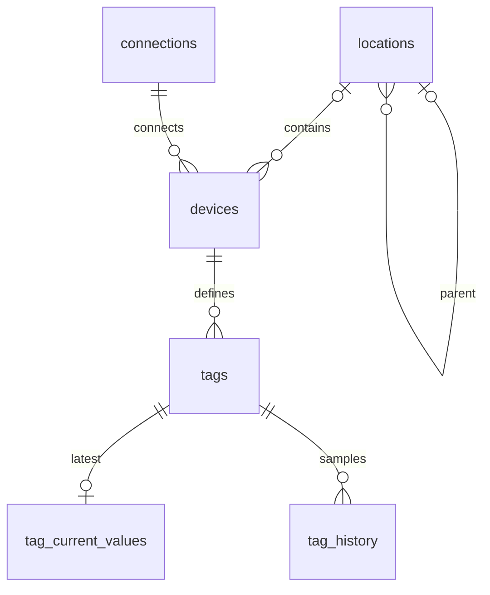

# PostgreSQL configuration model

Configuration uses four relational tables; current values and Phase 4 history use separate tables.
PostgreSQL is the sole runtime store; there are no
JSON configuration blobs or seeded devices, registers, ports, or sensors. All IDs are integer
primary keys (history uses BIGINT). Configuration tables have non-null `created_at` and `updated_at` timestamptz columns with
database creation defaults. API updates set `updated_at` in UTC; responses serialize UTC offsets.
Names are nonblank and at most 200 characters. Descriptions are optional (API limit 10,000 characters).

A Device references exactly one Connection and optionally one Location. A Tag references exactly
one Device. A Location may reference another Location as its parent. Names need not be unique;
different branches/devices can legitimately share display names.

## Tables

| Table | Configuration columns (in addition to ID and timestamps) |
| --- | --- |
| `locations` | name, nullable parent_id, nullable description, sort_order (default 0) |
| `connections` | name, protocol, enabled, nullable serial_port/baud_rate/parity/stop_bits/data_bits, nullable host/port, timeout_ms |
| `devices` | name, connection_id, nullable location_id, slave_id, enabled, nullable description |
| `tags` | name, unique key, device_id, register_type, address, data_type, byte_order, word_order, scale, offset, nullable unit, poll_interval_ms, writable, history_enabled, enabled, nullable min_value/max_value/description |

Connection protocol is `modbus_rtu` or `modbus_tcp`. Database checks require the complete matching
transport fields and prohibit fields from the other transport. TCP port 502 is an API/UI default;
the shared nullable column has no unconditional SQL default because RTU must store NULL there.
Enabled defaults to true and timeout_ms to 1000. Serial fields have no implicit database defaults.

Device slave IDs are 1–247, with a unique `(connection_id, slave_id)` constraint. Both transport
types use this conservative unicast scope. Special TCP identifiers and broadcast are not supported yet.

Tag keys are globally unique, 1–64 characters, matching `^[a-z][a-z0-9_]{0,63}$` (lowercase ASCII
letter first, then lowercase letters/digits/underscores). Register types, numeric data types, and
ordering are constrained to the values documented in [Modbus](modbus.md). Tags default to scale 1,
offset 0, big byte/word order, poll_interval_ms 1000, writable false, history_enabled false, enabled true.
Addresses are **zero-based offsets**, never vendor reference numbers. Address plus encoded register
width cannot exceed 65536. Discrete inputs and input registers cannot be writable. Boolean register
objects and numeric register encodings cannot be mixed. Scale, offset and limits must be finite;
minimum cannot exceed maximum. `unit` is at most 50 characters.

## Integrity and deletion

Every foreign key uses `ON DELETE RESTRICT`. A location with children/devices, a connection with
devices, or a device with tags cannot be deleted. The API returns 409 and the UI preserves the row.
Explicitly move or delete dependent records first. Missing references on create/update return 422.
Duplicate tag keys and duplicate connection/slave pairs return 409, backed by database uniqueness.

The database prevents direct self-parenting. The API also rejects longer location cycles, using a
transaction-scoped table lock to serialize hierarchy mutations before ancestor traversal. Direct SQL
tree editing is not a supported configuration path. PATCH distinguishes omitted fields from explicit
null: nullable fields may be cleared, while null in required fields is rejected after merging the patch.

Indexes cover all foreign keys, tag name, register type, and enabled state. The unique tag key
constraint supplies its lookup index. Case-insensitive name/key substring search is escaped so `%`
and `_` in user input are literal. Substring search can scan at larger scales; no speculative trigram
extension is introduced. List APIs have bounded pagination (default 100, maximum 500) and stable ordering.

## Current values (Phase 3)

`tag_current_values.tag_id` is both primary key and restrictive foreign key to `tags.id`: at most one
row per tag. Upserts replace latest state, never append historical samples.

- `value_numeric` (PostgreSQL NUMERIC), `value_boolean`, `value_text`: at most one populated field.
- `raw_value`: optional text representation of the decoded pre-scaling source value.
- `quality`: GOOD, STALE, BAD, COMM_ERROR, DISABLED.
- `source_timestamp`: last successful reading time; failures do not advance it.
- `updated_at`: UTC time of the latest state change, including quality-only transitions.
- `error`: diagnostic, cleared by success; `revision`: atomically incremented positive per-tag counter.

GOOD requires a typed value, source timestamp and no error. Other states may have no sample yet or
preserve the previous successful value. Finite numbers and a single typed field are database-enforced.
The primary key handles lookup; a quality index supports maintenance/filtering. NUMERIC retains large
integers/decimals. JSON `value_numeric` stays numeric, with `value_numeric_exact` as a precision companion
for browser display beyond the IEEE-754 safe integer range. PostgreSQL tests verify uint64 precision.

Success replaces value/raw/source time and sets GOOD. A source communication failure preserves these
fields and sets COMM_ERROR; invalid source/configuration sets BAD. Disabled tags/devices/connections
become DISABLED without acquisition. Re-enabling awaits a fresh sample. Encoding, address, scale or
limit edits invalidate existing values until recollected. Never-sampled enabled tags may have no row:
snapshots return null quality/value and revision 0, shown as "Awaiting value".

Tag deletion explicitly removes its derived latest row in the same transaction, then the tag, and
publishes an invalidation. This is not cascading child-configuration deletion; existing restrictions
remain in force. Quality transitions share the same upsert/notification service as telemetry updates.

## Historical values (Phase 4)

`tag_history` stores BIGINT id, restrictive tag_id FK, nullable NUMERIC value_numeric / BOOLEAN
value_boolean / TEXT value_text, quality, nullable source_timestamp, recorded_at (UTC timestamptz),
and nullable raw_value. GOOD has exactly one typed field and an acquisition timestamp; other qualities
must have no value fields. Numeric values must be finite. Indexes cover tag_id, recorded_at, and
(tag_id, recorded_at, id), supporting time filtering, retention and deterministic latest-row lookup.

Tags add history_mode (default every_sample), nullable history_interval_ms, nullable
history_change_threshold, and nullable history_retention_days. Existing history_enabled remains false
by default. Validity constraints enforce modes, positive interval/retention, finite non-negative
threshold, interval >= poll interval for fixed_interval, and a threshold for numeric on_change.
These are validated even when history is disabled, so enabling a saved policy cannot activate an
invalid configuration. Irrelevant interval/threshold values may remain saved but are ignored by policy.

A tag with retained history returns HTTP 409 on deletion; its current row remains intact. Disable it
and configure retention, or manage deliberate archival/removal through a future feature. No history
purge API or cascading deletion is introduced. Changing encoding or units does not reinterpret older
rows; response metadata describes current configuration. Use a new tag when a measurement's meaning changes.

See [history policy, queries, and retention](history.md).

## Migration revisions

- `0001_foundation`: unchanged initial migration history.
- `0002_configuration`: creates these four tables, checks, foreign keys, uniqueness constraints and
  indexes. Downgrade drops them in dependency order and destroys their configuration data.
- `0003_current_values`: adds latest typed values, quality/revision checks and quality index;
  downgrade removes current state only. Existing migrations are unchanged.
- `0004_history`: creates history with indexes/checks and adds Tag policy fields. Existing enabled
  history flags begin every-sample storage after upgrade. Downgrade removes history and policy fields,
  preserving current values and the original history_enabled flag.

Models subclass `app.db.base.Base` and are exported from `app.models` for Alembic discovery. Never
use `create_all` at application startup. Run migrations from the repository root so `.env` is loaded.
The async online path uses `connection.run_sync`; offline upgrade/downgrade SQL is supported.

Fast CRUD tests use an isolated SQLite database with foreign keys enabled. SQLite does not validate
PostgreSQL regex/finite-number checks or lock semantics. The opt-in `tests/test_postgres.py` creates a
randomly named schema, applies real migrations, compares ORM metadata, exercises CRUD/constraints and
concurrent hierarchy updates, and tests downgrade/replay. It drops only its own test schema. See README
for `TEST_DATABASE_URL`; a skipped test is not evidence of PostgreSQL integration success.

## Planned entities (not implemented)

| Entity | Planned purpose |
| --- | --- |
| users | Identities, permissions and account lifecycle. |
| audit_log | Actor, action, target, timestamp and changes/results, including device writes. |

Current and historical values remain separate concepts. Tag values include GOOD, STALE, BAD,
or COMM_ERROR quality; missing values must not be represented as good zeroes. Configuration flags
are not substitutes for runtime values. Sensitive transport data must not be copied into audit logs.

## Modbus runtime and provenance (Phase 5)

Revision `0005_modbus_runtime` adds nullable constrained `source` to current/history rows:
`simulator`, `modbus_rtu`, or `modbus_tcp`. Existing rows stay NULL (unknown). Failed reads retain the
previous current value's source; value-free history markers have no source. Mixed-source SQL buckets
return NULL rather than asserting a single origin.

`connection_runtime.connection_id` is a restrictive primary-key foreign key, with state, configuration
version, UTC updated_at/last_success/last_error_at and readable last_error. States are CONNECTED,
DISCONNECTED, CONNECTING, ERROR, DISABLED. Expiring transport-test request/result fields hold a token,
configuration version, timestamps, success/message/latency; they cannot encode Modbus commands.
Connection deletion explicitly removes this derived row in the same transaction; devices still block
configuration deletion with 409. No persistent Device table is needed for derived availability.

`worker_runtime` has one checked singleton id, source mode, hostname, UTC heartbeat/discovery times,
serial_ports JSON and discovery_error. The JSON is derived host discovery, not runtime configuration.
A heartbeat older than 15 seconds is stale. Serial discovery refreshes every 30 seconds.
Downgrade removes these two derived tables and source columns, preserving prior configuration/history.

## Commands (Phase 6)

`0006_commands` adds `commands` and `worker_runtime.writes_enabled` (default false).
Command id and unique request UUID identify a durable manual action. A restrictive tag_id FK preserves
command records on attempted Tag deletion (409). Requested, previous and verified values use paired
nullable NUMERIC/BOOLEAN columns with exclusivity constraints; requested has exactly one value.
PostgreSQL constraints reject nonfinite numbers, invalid statuses/sources/modes, negative attempts,
nonpositive revisions, SUCCESS without a verified value, and inconsistent terminal/completion times.

UTC created/expires/started/completed times, status, source, mode, confirmation, attempts, revision,
error and Tag/Device/Connection configuration versions capture lifecycle. Indexes cover status+created,
tag+created and creation time. No JSON value/configuration blobs or runtime entity defaults are used.
The worker flag is derived process state, not an API-editable configuration switch. Downgrade removes
command records and the runtime flag; previous migrations remain unchanged.

See [command protocol](commands.md). Source supports manual/automation/system in storage. Phase 7 adds Automation commands; Phase 10
attributes manual requests to authenticated users. Interactive APIs cannot impersonate Automation.

## Phase 7 Automation

Migration `0007_automation` adds automation_rules, automation_conditions, automation_actions,
automation_runtime, automation_executions and automation_execution_commands. Conditions/actions
use separate Numeric and Boolean columns with exclusivity constraints, restrictive Tag/rule FKs
and FK indexes. Rules store ALL/ANY, priority, FOR and cooldown. Runtime stores edge/latch/timer
state; executions retain diagnostic snapshots and link relationally to existing commands. Referenced
configuration and retained execution records are never silently cascaded away. See [automation](automation.md).

## Alarms (Phase 8, migration 0008_alarms)

- alarm_rules: restrictive Tag FK, typed numeric/boolean threshold, validated operator/severity,
  enabled, FOR milliseconds, hysteresis, notification flag and UTC configuration timestamps.
- alarm_runtime: one restrictive rule FK/PK and pending true_since. Restart resets pending timers.
- alarm_events: retained typed trigger value and metadata snapshot, rule/Tag restrictive FKs,
  ACTIVE/ACKNOWLEDGED/CLEARED state, UTC lifecycle times, close reason and monotonic revision.
  A partial unique index allows at most one open event per rule. Lookup indexes cover Tag/rule,
  severity/state and activated time. Referenced rules cannot be deleted.
- telegram_destination: checked singleton ID=1 and non-secret chat ID; no bot token in database.
- notification_deliveries: optional restrictive event FK, frozen destination/message, kind/status,
  attempt count and UTC delivery timestamps; unique (event_id, kind) prevents duplicate activation
  enqueue. Explicit test deliveries have no event. Status and creation indexes support outbox lookup.

Downgrade removes these new tables only, in FK-safe order. Previous revisions are unchanged.
No alarm-event deletion API or retention is implemented; historical events remain available.

## Phase 8.1 serial adapter binding

Migration `0009_serial_binding` adds Connection serial_port_mode (default manual), USB VID/PID,
serial number, hardware ID, manufacturer/product and opt-in serial_probe_enabled. Protocol constraints
require a static port in Manual or VID/PID with null port in Auto; TCP remains separate. Existing
records remain unchanged/manual. connection_runtime adds detected_port, detection_status, detected_at,
detection_error and redetect request/completion IDs. Configuration identity and transient COM remain
separate; no new infrastructure/tables. Downgrade requires Auto records first converted to Manual
with explicit ports. Older migrations are not changed.

## Phase 9 dashboard configuration

Migration `0010_dashboards` adds `dashboards`, `dashboard_widgets`, `dashboard_widget_tags` and `dashboard_widget_layouts`. Slugs are unique; a partial unique index enforces one default. Bindings have restrictive Tag FKs and ordered multi-Tag support. Responsive layout is stored in integer columns per breakpoint, with bounds constraints; only type-specific settings use validated JSON. Dashboard revision detects stale layout saves. Deletion explicitly removes dashboard-owned rows without deleting external entities. See [details and API](dashboards.md).

## Phase 10: users, sessions and attribution

Migration `0011_auth` adds:

- `users`: unique normalized username, Argon2id password hash, checked ADMIN/OPERATOR/VIEWER role,
  enabled flag, UTC created/updated and last login timestamps.
- `auth_sessions`: SHA-256 digest of a random opaque session token as primary key, CSRF digest,
  restrictive User FK, creation and indexed expiry. Plain session tokens are never stored.
- `login_limits`: hashed IP/username buckets, window start and failure count. Expired buckets are
  removed during login. A transaction advisory lock serializes login/account changes across API processes.
- `audit_log`: immutable-by-API action, entity type/ID, safe summary, UTC timestamp, nullable User FK
  (`SET NULL`) and username snapshot. User/action/time indexes support bounded paginated queries.
- `commands.requested_by` and `alarm_events.acknowledged_by`: indexed nullable User FKs (`SET NULL`)
  plus username snapshots. Legacy and Automation records remain valid with null human attribution.

Deleting a user first revokes their sessions, then retains audit/command/alarm history with null user
references and preserved usernames. Last enabled ADMIN checks run under the shared PostgreSQL lock.
Upgrade/downgrade use a new revision; older migrations are unchanged. Downgrading removes authentication
and attribution tables/columns, so back up retained audit information before an intentional downgrade.

## Phase 11 sync schema ? migration 0012_edge_cloud

`sync_state` persists database role/installation identity and sync health. `sync_outbox` stores UUID events, priority, payload and retry time. `edge_installations` stores enabled machine identities and token digests. `sync_receipts` deduplicates events per Edge. `sync_mappings` maps stable UUID identities/source keys to Cloud keys and monotonic source sequences. `remote_requests` tracks Cloud user attribution and expiring correlated command/acknowledgement delivery; `remote_inbox` deduplicates Edge processing. Restrictive FKs preserve history; Cloud user references become NULL on deletion while attribution snapshots remain. Existing commands add PENDING_EDGE/DELIVERED. Users/password hashes never mirror. See [sync lifecycle](edge-cloud.md).

## Migration 0013: replaceable sync state

`sync_outbox.coalesce_key` is nullable and unique. Current Tag/connection/worker state
uses an entity + local key; one installation is persisted per Edge database. Other records
keep NULL and remain durable independent events. Replacements get a fresh sequence and
UUID. `(entity,id)` supports separate queue reads. Migration compacts only old state rows;
history/Alarm/Command/Automation events retain identifiers and payloads. No change to Tag
history policy or current/history storage. [Upgrade and ordering semantics](realtime-sync.md).
